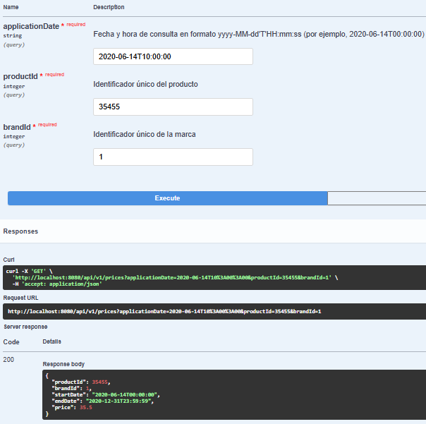
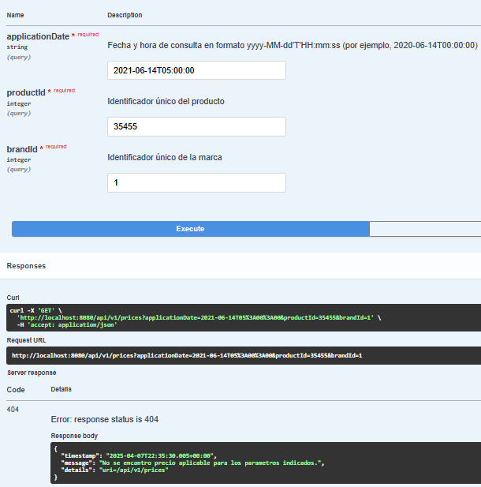
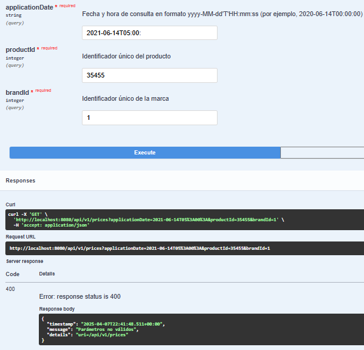
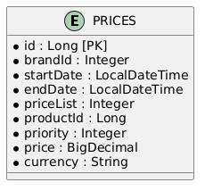
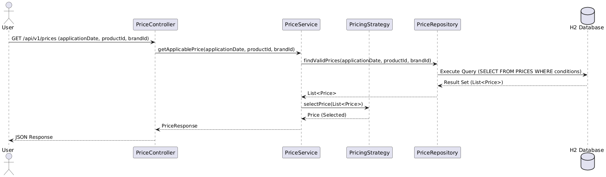

# Inditex Core Platform

Este documento explica la arquitectura hexagonal aplicada junto a DDD, el uso de patrones de diseño, herramientas empleadas, y el proceso completo para probar y desplegar el proyecto mediante CI/CD. Además, se incluyen diagramas UML y casos de prueba tanto exitosos como de excepciones.

## 1. Revisión Técnica y Cumplimiento de Requisitos

### Arquitectura Hexagonal

La arquitectura hexagonal (o Ports and Adapters) define una separación clara entre la lógica de negocio y las interfaces externas. Esto se logra dividiendo el sistema en tres capas fundamentales:

- `	`Dominio (domain) La clase Price representa la entidad de negocio, encapsulando todos los atributos relevantes (como priority, price, curr, etc.).
- `	`Beneficio: Mantener el núcleo del negocio independiente y testable, sin ataduras a detalles de infraestructura.
- `	`Aplicación (application) El servicio PriceService orquesta los casos de uso, coordinando la lógica de negocio y la infraestructura. Además, implementa el patrón Strategy para la selección de precios a través de la interfaz PricingStrategy y su implementación HighestPriorityPricingStrategy.
- `	`Beneficio: Permite incorporar nuevas estrategias sin alterar la lógica principal, facilitando la escalabilidad y manteniendo el código desacoplado.
- `	`Infraestructura (infrastructure) Aquí se ubican componentes como el PriceRepository, que se comunica con la base de datos H2, y el PriceController Expone el endpoint REST documentado con OpenAPI First, garantizando la coherencia entre la API y su documentación.
- `	`Beneficio: Abstraer los detalles técnicos y permitir una integración rápida con tecnologías externas (por ejemplo, la base de datos H2).

### Beneficios de Hexagonal y DDD

- `	`Desacoplamiento y claridad en la separación de responsabilidades.
- `	`Facilidad para realizar pruebas unitarias e integración, ya que la lógica de negocio se encuentra aislada.
- `	`Escalabilidad ante nuevos requerimientos o cambios de infraestructura.

## 2\. Patrones de Diseño

### a) Strategy Pattern
- `	`Qué hace: La estrategia definida en HighestPriorityPricingStrategy se encarga de seleccionar el precio aplicable en función de la prioridad, decidiendo cuál registro aplicar entre las opciones encontradas.
- `	`Beneficios:
- `	`Escalabilidad: Permite agregar nuevos criterios o estrategias sin modificar el código base del servicio.
- `	`Precisión: La lógica de negocio se especializa en la selección del precio apropiado, lo que garantiza un resultado correcto y consistente.
- `	`Motivación: Sin este patrón, la lógica de selección quedaría embebida en el servicio, generando un mayor acoplamiento y dificultando el mantenimiento y extensión del sistema.

### b) Builder Pattern

- `	`Uso: Se utiliza en la clase Price (mediante la anotación @Builder de Lombok) para construir objetos con múltiples atributos de forma clara y segura.
- `	`Beneficios:
- `	`Claridad y legibilidad en el código al construir instancias complejas.
- `	`Reducción de errores: Facilita la creación de objetos correctos sin la necesidad de constructores complejos.
- `	`Motivación: Proporciona una forma segura de instanciar objetos en los tests y en la lógica de negocio, asegurando consistencia en el estado de los objetos.

### c) Otros Patrones Usados

- `	`ControllerAdvice: Centraliza el manejo de excepciones, permitiendo una gestión uniforme de errores como ResourceNotFoundException y BadRequestException. Esto garantiza respuestas claras y consistentes con códigos HTTP específicos, mejorando tanto la experiencia del cliente como el mantenimiento del sistema. Además, simplifica las pruebas al validar los escenarios de error de forma centralizada.
- `	`Singleton Implícito (Spring Boot): La inyección de dependencias y la gestión de Beans (por ejemplo, en PriceService) garantizan que existan instancias únicas donde sea necesario, facilitando el mantenimiento y la testabilidad.

## 3\. Herramientas y Extras Utilizados

### Lombok

- `	`Anotaciones utilizadas:
- `	`@Data: Automatiza la generación de getters, setters, equals, hashCode y toString.
- `	`@Builder: Facilita la construcción de objetos complejos.
- `	`@RequiredArgsConstructor: Genera constructores para campos finales; elimina la necesidad de usar @Autowired de forma explícita.
- `	`Beneficios técnicos:
- `	`Reducción de código repetitivo: Se minimiza el boilerplate, mejorando la legibilidad.
- `	`Facilidad en pruebas: Configuración rápida de clases con dependencias inyectadas, lo que simplifica las pruebas unitarias.

### Jacoco

- `	`Uso y configuración:
- `	`Se integró en el build.gradle para monitorear la cobertura de pruebas.
- `	`Se generó un reporte de cobertura que alcanzó el 100% en la lógica del dominio (nucleo DDD).
- `	`Comando para generar reporte:

bash

./gradlew jacocoTestReport

- `	`Ruta del Reporte: build/reports/jacoco/test/html/index.html
- `	`Beneficio: Proporciona una visión clara de la efectividad de las pruebas, garantizando que la lógica crítica está completamente validada.

### SonarQube

- `	`Se utilizó para realizar análisis estáticos del código, detectando posibles problemas y asegurando la adherencia a los principios de Clean Code., se realizo utilizando el plugin de Sonarqube

## 4\. CI/CD: Pipeline y Configuración Específica

### Explicación del Proceso de CI/CD

El pipeline de CI/CD se configuró mediante GitHub Actions para automatizar el flujo de integración y despliegue. Los pasos clave incluyen:

1. `	`Compilación y Ejecución de Pruebas: Se compila el proyecto y se ejecutan los tests unitarios y de integración utilizando Gradle. La generación del informe de cobertura se ejecuta usando el comando:

bash

./gradlew jacocoTestReport

1. `	`Análisis de Código con SonarQube: Se realiza un análisis estático del código para detectar cuestiones de calidad y adherencia a los estándares de Clean Code, desde el ide intellij.

### Por Qué se Creó el Workflow en la Raíz del Repositorio

- `	`Necesidad de Centralización: Para que el pipeline de GitHub Actions pueda detectar y ejecutar correctamente las etapas de CI/CD, fue necesario que el archivo de workflows (ci-cd-pipeline.yml) se ubicara en el directorio .github/workflows en la raíz del repositorio.
- `	`Movimientos de Archivos Críticos: Los archivos build.gradle, gradlew, gradlew.bat y settings.gradle se ubicaron en la raíz del repositorio. Esto fue imprescindible porque el pipeline requiere la existencia de estos archivos en el proyecto raíz para ejecutar todos los comandos de compilación, prueba y generación del reporte de cobertura.
- `	`Flujo de Trabajo con Branches:
- `	`Branch feature/core-platform: Se trabajó en esta rama para desarrollar las nuevas funcionalidades y mejoras.
- `	`Pull Request a master: El pipeline se ejecutó automáticamente cuando se realizó un Pull Request desde feature/core-platform hacia master, garantizando que el código integrado cumpla con los altos estándares de calidad y cobertura.

### Beneficios del Enfoque CI/CD

- `	`Automatización Completa: Permite que cada cambio en el código sea validado con pruebas, análisis de cobertura y calidad, asegurando la confiabilidad del sistema.
- `	`Integración Continua: El uso de GitHub Actions y los movimientos de archivos a la raíz aseguran que el proceso de CI/CD se ejecute sin inconvenientes, aumentando la eficiencia del equipo de desarrollo.

## 5\. Proceso Completo de Pruebas y Ejecución

### Paso a Paso para Probar el Proyecto

1. `	`Clonar el Repositorio:
- `	`URL del repositorio: https://github.com/OmarHoyos12/bcnc
- `	`Ejecutar en terminal:

bash

git clone https://github.com/OmarHoyos12/bcnc.git

2\.	Abrir en IntelliJ IDEA:

- `	`Importar el proyecto en IntelliJ como proyecto Gradle.
- `	`Ejecutar el build inicial con:

bash

./gradlew build

3\.	Ejecutar la Aplicación:

- `	`Localizar la clase InditexApplication en la raíz del paquete.
- `	`Ejecutar el método main para iniciar la aplicación.

4\.	Ejecutar Pruebas Unitarias e Integración:

- `	`Ejecutar: InditexApplicationTests

5\.	Generar Reporte de Cobertura con Jacoco:

- `	`Ejecutar:

bash

./gradlew jacocoTestReport

- `	`Navegar a la ruta:
- `	`build/reports/jacoco/test/html/index.html

6\.	Acceso a Herramientas de Desarrollo:

- `	`Swagger UI: http://localhost:8080/swagger-ui.html Permite probar el endpoint REST enviando parámetros como applicationDate, productId y brandId.
- `	`H2 Console: http://localhost:8080/h2-console Credenciales:

§	Usuario: inditex

§	Contraseña: inditex

## 6\. Casos de Prueba

### Casos Exitosos en el Endpoint (Probar via Swagger y Postman)

1. `	`Prueba 1:
- `	`Parámetros:

json

{

"applicationDate": "2020-06-14T10:00:00",

"productId": 35455,

"brandId": 1

}

- `	`Respuesta Esperada:

### 2\.	Prueba 2: (Otras variantes para distintos horarios de solicitud)

json

{

"applicationDate": "2021-06-14T05:00:00",

"productId": 35455,

"brandId": 1

}

- `	`Respuesta Esperada:

### 2\.	Excepción: BadRequestException

- `	`Condición: Parámetros mal formateados o inválidos.
- `	`Ejemplo: Enviar una fecha en un formato no válido.
- `	`Respuesta Esperada:

## Pruebas con Postman

Para probar los endpoints de este proyecto, puedes importar la colección de Postman disponible en el archivo [PriceAPI.postman_collection.json](PriceAPI.postman_collection.json) ubicado en la raíz del repositorio.

### Cómo Importar
1. Abre Postman.
2. Ve a **File > Import**.
3. Selecciona el archivo `PriceAPI.postman_collection.json`.

## 7\. Diagramas UML

### Modelo de Base de Datos

### Diagrama de Secuencia

## 8\. Consideraciones Finales

- `	`CI/CD y Flujo de Trabajo en GitHub:
- `	`El pipeline fue configurado utilizando GitHub Actions. Para que este proceso funcionara correctamente, el archivo de workflow (ci-cd-pipeline.yml) fue ubicado en el directorio .github/workflows en la raíz del repositorio junto con los archivos críticos build.gradle, gradlew, gradlew.bat y settings.gradle.
- `	`Se trabajó en la rama feature/core-platform y, al realizar el Pull Request hacia master, el pipeline se ejecutó automáticamente, validando la compilación, ejecución de pruebas, generación del reporte de cobertura, y análisis de calidad con SonarQube.
- `	`Extras Cumplidos:
- `	`Se superó el requisito de cobertura, logrando un 100% en la lógica del núcleo de DDD.
- `	`Se implementó un flujo de CI/CD robusto que garantiza la calidad del código al integrarse de forma continua.
- `	`El uso de patrones de diseño (Strategy, Builder, ControllerAdvice) y herramientas (Lombok, Jacoco, SonarQube) ha generado un proyecto escalable, testeable y mantenible.

